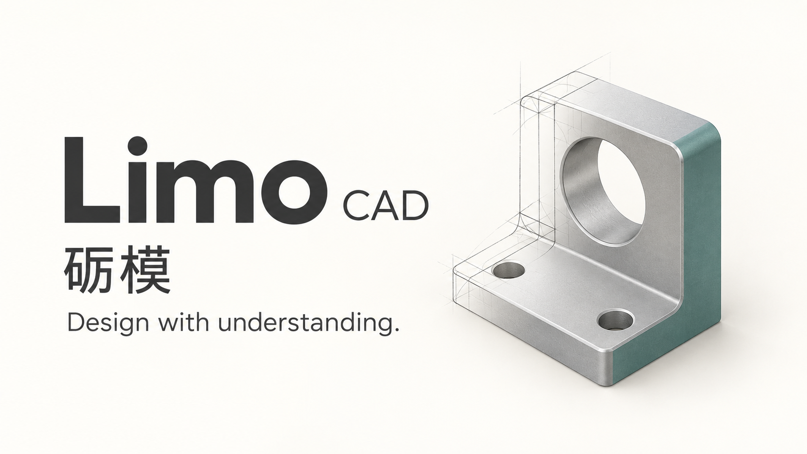

# Proposal: Limo · 砺模

**Status: Proposed · 2026-10-01**

Rename **noBS CAD** to **Limo**, introduced as **Limo CAD / 砺模 CAD**.

> **Design with understanding.**

Limo brings together two kinds of progress: refining a model and developing
the understanding behind it. A design becomes more useful as we work on it;
we become more capable as we understand the choices we make.

## The roots

The Chinese name **砺模**, with the intended reading **Lìmó**, pairs **砺**
(*lì*) with **模** (*mó*). 砺 connects honing and sharpening with developing
oneself through practice. 模 gives the name its model and pattern association.
See the dictionary entries for
[砺](https://www.zdic.net/hans/%E7%A0%BA) and
[模](https://www.zdic.net/hans/%E6%A8%A1).

The Latin **līmō** adds a complementary connection: filing, polishing, and
refining, including figurative refinement. See
[Lewis and Short's entry](https://atlas.perseus.tufts.edu/dictionaries/entry/urn:cite2:scaife-viewer:dictionary-entries.atlas_v1:lat.ls.perseus-eng2-n26650/).

Together, these roots suggest a simple idea:

> **Refine the model. Develop the designer.**

砺模 is a coined pairing; this story is its intended brand interpretation.

## A name to grow with

Limo is short, easy to introduce, and welcoming in a classroom, at a kitchen
table, in a workshop, or in a professional design review. Someone exploring a
first mechanism and someone refining a demanding assembly can recognize the
same idea: make the work better, and understand it more deeply.

Use **Limo CAD** in introductions, search listings, downloads, and links so
people can recognize and find the application. Use **Limo** once the context
is established. The English and Chinese names identify the same product.

- **Name:** Limo / 砺模.
- **With descriptor:** Limo CAD / 砺模 CAD, with a real space before CAD.
- **Bilingual display:** Limo · 砺模.
- **Suggested English pronunciation:** "LEE-moh," an approximation of Lìmó.

## Understanding through design

Mechanical design offers a natural way to learn. Change a dimension and see
how the part responds. Assemble two components and investigate their fit.
Move a mechanism and ask what constrains its motion. Compare two approaches
and understand why one suits the job.

Lessons, worked examples, and useful help can connect those actions to the
concepts behind them: geometry, constraints, fits, fasteners, materials,
manufacturing, and engineering judgment. The model remains something a person
can inspect, edit, and build on as their understanding develops.

Analysis belongs in that journey too: from existing fit and motion checks to
richer analysis as validated capabilities mature. Mechanical CAD stays at
the center.

There is already a foundation in the
[first-part lesson](INSTALL.md#make-your-first-part),
[recipe library](../examples/scripts/README.md),
[construction playback](native-scripts.md), and
[engineering knowledge](../knowledge/index.md). Improving access to these
resources, through clear introductions and help close to the task, makes the
project easier to discover and keep learning with.

## Working directly and with AI

People can work directly or connect an MCP-compatible AI agent. The
[existing MCP interface](../mcp-server/README.md) exposes modeling operations
and bundled engineering knowledge, and agent-built work retains editable
construction history. People can bring their preferred agent and model to
the same design tools.

Looking ahead, integrated AI guidance could help explain a modeling step,
find a relevant example, explore a design choice, or guide someone through a
mechanical concept. Human-readable resources and agent-accessible knowledge
should build on the same material, so the explanations and the work can be
examined together. See the [current help access guide](agentic/HUMAN_HELP.md).

Integrated tutoring and conversational design wizards are future direction.
They retain their own review under the project's priorities:
**reliability, performance, and ease of use**.

## Proposed introduction

> **Limo CAD · 砺模**
>
> **Design with understanding.**
>
> Open-source mechanical CAD for parts, assemblies, and drawings.
> Explore their motion. Work directly or with an agent.
>
> Learn through editable examples and engineering resources as you build.

Use **"Design with understanding."** as the main catchphrase, with
**"Refine the model. Develop the designer."** as the longer mission line.

Public copy should continue to show **pre-alpha** maturity. CAM is developing
and not production-safe; strength analysis is future work. See the
[current product direction](goals.md).

## Visual direction

*AI-generated concept for discussion; not an application screenshot, a
validated part, or a final logo. [Generation prompt and provenance](assets/branding/limo-proposal-concept.txt).*

Keep the name prominent and the geometry simple. For the public banner, a
real editable model or a brief dimension-change demonstration can make the
promise tangible. Review final identity assets in the implementation PR.

## Review and next steps

1. **Review this proposal.** Agree on Limo / 砺模, the naming conventions, and
   the main catchphrase through the normal PR process. Record the decision in
   [ADR 0007](adr/0007-limo-name.md). This PR adds proposal documentation and
   a concept visual; it does not perform the application rename.
2. **After acceptance, submit the rename implementation.** Update public
   copy, application display names, and release presentation. Inventory
   packaging and persistent identifiers; preserve existing projects and agent
   setups. Use "Limo CAD (formerly noBS CAD)"
   during the transition so existing users can find the project. Check the
   chosen repository, site, and account names before the public cutover.
3. **Consider a dedicated organization separately.** A Limo organization
   could give the application, learning resources, and connectors a shared
   home. Review its ownership, maintenance responsibilities, and any repository
   transfer separately after the name is accepted.
