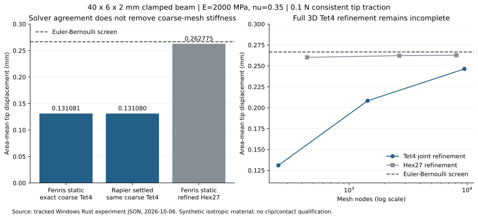

# Rust structural and world-simulation qualification

Isolated experiment for [Limo-CAD structural analysis #336](https://github.com/limo-cad/Limo-CAD/issues/336).
See [the project plan](../../docs/SIMULATION-EXPERIMENT.md) for the existing
capability audit, adversarial section review, library evaluation and milestones.
The [research index](../../docs/analysis/RESEARCH-INDEX.md) includes the historical
reference-solver study, actual Linux runner evidence and private design archive.

This Cargo workspace is independent of the application. The lockfile pins the
actual dependency graph. Successful exploratory execution and successful
engineering qualification are separate outcomes.

## Reproduce

From the repository root:

```powershell
$env:CARGO_BUILD_JOBS = '1'
cargo run --locked --manifest-path experiments/rust-simulation/Cargo.toml --bin structural -- experiments/rust-simulation/structural-results.json
cargo run --locked --manifest-path experiments/rust-simulation/Cargo.toml --bin world -- experiments/rust-simulation/world-results.json
cargo run --locked --manifest-path experiments/rust-simulation/Cargo.toml --bin same_mesh -- experiments/rust-simulation/same-mesh-results.json experiments/rust-simulation/world-results.json
cargo clippy --locked --manifest-path experiments/rust-simulation/Cargo.toml --all-targets -- -D warnings
cargo fmt --manifest-path experiments/rust-simulation/Cargo.toml --check
```

The development profile optimizes the experiment and Rapier numerical kernels.
Other dependencies remain unoptimized to keep compilation modest; Fenris/faer's
generic kernels are optimized in the benchmark crate. The first unoptimized
Rapier run exceeded its 45-second per-beam budget; the optimized run completes.
Wall time is checked between timesteps, so it does not interrupt an individual
solver call. Process isolation/hard deadlines are future integration requirements.

The checked-in reports were produced on Windows with Rust 1.99.0, 2026-10-06.
Numbers below describe the specific material/settings/loads in those reports,
not measured properties of Bambu PETG Basic or PLA prints.

## Fenris + faer: observed structural feasibility

`structural.rs` uses Fenris/fenris-solid 0.0.33 and faer 0.24.4. A 40x6x2 mm
cantilever has synthetic isotropic E=2000 MPa, nu=0.35, a fully constrained root
and uniform 0.1 N transverse tip traction. Quadratic Hex27 elements use 3-point
Gauss integration per axis and consistent tensor-product Simpson tip loads.
Sparse assembly is converted from Fenris CSR to faer CSC; the reduced system is
solved by sparse Cholesky without explicit inversion or dense global stiffness.

Observed mesh refinement:

- 30 elements / 441 nodes: area-mean tip **0.2602416385 mm**.
- 240 elements / 2,665 nodes: **0.2622605488 mm**.
- 810 elements / 8,113 nodes: **0.2627745908 mm**.
- Last refinement change **0.196004%**; Euler–Bernoulli reference **0.2666666667 mm**,
  finest difference **-1.45953%**. A 3D clamp and shear response differ from the
  one-dimensional beam idealization; this comparison is a screening benchmark.

Free-DOF equilibrium residual is at most 1.35e-9 relative. Finest root force is
-0.100000000099 N, with the expected resultant moments; strain energy
0.013138729543 N mm agrees with half external work. Removing root constraints
produces a non-positive Cholesky pivot; an independent rigid-translation
nullspace/load-compatibility check also rejects that unsupported model.

The executable enforces finite/positive values, equilibrium, reactions/moments,
energy/work consistency, <0.5% final refinement change and <3% beam-reference
screening difference. All passed. Optimized inclusive mesh/assembly/check/solve
times were about **0.035 / 0.204 / 1.440 s**, rather than the initial debug run's
2.87 / 23.65 / 74.47 s. No stress, contact, plasticity, creep or clip solve is
claimed by this benchmark.

## Rapier: rigid motion works; stiff FEM remains unqualified

`world.rs` uses rapier3d-f64 0.36.0 with `fem` and `enhanced-determinism`, SI
internally, and millimetres in output. The rigid falling-ball test runs at
1/120 and 1/240 s. Its 1-second position errors are **-10.21875 / -5.109375 mm**;
halving the timestep halves the integration error. The ball settles about
**0.070 mm** below the ideal plane contact height, with zero final speed.
That establishes these smoke-test outcomes, not mechanism/CCD/friction qualification.

The soft beam uses the same dimensions/E/nu/total load as the structural test,
linear tetrahedra, consistent uniform tip traction on boundary triangles and
synthetic density 1270 kg/m^3. Particle masses are split uniformly. Sleeping,
extra edge springs, shape matching and volume preservation are disabled.
It runs for 0.5 s, tracks final-window displacement stability and every particle's
velocity, and compares timestep, axial resolution and solver controls.

The initial 250-iteration runs report **0.3903 / 0.4144 / 4.3430 mm**; all are
nonstationary. Increasing X resolution alone is not a complete 3D convergence
study, and these are transient positions, not static compliance results.
The direct-factorization threshold control produces identical beam trajectories:
Rapier's skyline factorization handles constraint responses, while the elasticity
predictor still uses PCG. Do not describe that control as a direct predictor solve.

Pinned source inspection identifies a useful diagnostic hypothesis: the predictor
uses block-Jacobi PCG, a hard iteration cap, and zero-starts each substep; its
caller discards the returned iteration count. Configured tolerance does not prove
that tolerance was reached. A stiff small beam may need more iterations or a
different preconditioner. Raising the cap from 250 to 2000 at the same coarse
grid/timestep produces a near-stationary **0.1310795160 mm** result; final-window
change is 9.04e-11 mm and maximum particle speed 2.11e-9 m/s. That is still
**50.85% below** beam theory. This supports iteration truncation as a contributor
to the earlier nonstationarity, but does not establish the achieved CG residual
or explain all compliance error. Coarse linear-tetrahedral bending/locking is a
mesh hypothesis to test, not a verified diagnosis.
These observations do not establish a general Rapier defect. The fresh same-mesh
probe below resolves most of the settled compliance discrepancy. Achieved
residual/iteration diagnostics, full 3D mesh/timestep convergence, and dynamic
equilibrium/reactions/energy are still needed before accepting force/stress results.

The world executable rejects nonfinite results, failed contact settlement and
time/step-budget failures, and records each failure before returning a failure
status. It deliberately reports rather than gates beam-reference error and
stationarity, so exit zero does **not** mean the FEM beam is qualified.

## Fresh pass: distinguish solver agreement from mesh accuracy

`same_mesh.rs` takes the exact undeformed particles, Tet4 connectivity and tip
boundary triangles from Rapier's cuboid builder. It converts metres to mm and
uses Fenris linear Tet4 elasticity with E=2000 MPa, nu=0.35 and faer sparse
Cholesky. Root constraints and area-weighted tip traction match the world case;
the force sign is reversed, so displacement magnitudes are compared. One-point
quadrature is exact for this constant linear-element stiffness integrand.

The coarse static tip is **0.1310809759 mm**, versus the settled Rapier result
**0.1310795160 mm**: **0.001114%** relative difference. Thus essentially all of
the earlier 50.85% beam-reference deficit is shared coarse spatial stiffness
error in this particular low-load case. This does not uniquely prove shear
locking and does not qualify every Rapier path.

The probe reads the supplied world report, validates its material/units/load
and selects exactly one matching completed case. It independently requires
finite positive displacement and near-stationary speed/window diagnostics, then
enforces a 2% same-mesh agreement gate. The report embeds the actual matched row
and its source path. CI passes the **current runner's** world report, so an old
hardcoded displacement cannot mask a changed or unsettled world result.

Independent spatial sweeps give static tip values:

- [21,4,3], 252 nodes / 600 Tet4: **0.13108098 mm**.
- X-only [41,4,3], 492 / 1,200: **0.18603326 mm**.
- Section-only [21,7,5], 735 / 2,400: **0.13863229 mm**.
- Joint [41,7,5], 1,435 / 4,800: **0.20829416 mm**.
- Joint [81,13,9], 9,477 / 38,400: **0.24639128 mm**.

Every static case passed positive volume, integrated area/load, sparse-factorization,
equilibrium, root force/moment and energy/work checks. The finest result remains
7.60% below beam theory and 6.23% below refined Hex27, so this sweep is diagnostic,
**not converged Tet4 qualification**. The final coarse-to-fine joint refinement
still changes the result materially. Nodal-field agreement, Rapier reactions,
contact, stress and manufactured-part behavior were not tested here.

The [retained Linux run](evidence/linux-37461574608/README.md) passed the original
qualification workflow and reproduced the recorded Rapier numerical diagnostics
to their stored digits. That observed agreement is not a general determinism
guarantee; the new probe was added after that historical run.



`plot_results.py` regenerates the SVG/PNG from the tracked JSON using Matplotlib.
It is optional report tooling, not an application or numerical-solver dependency.
The plot has been visually inspected. A fresh independent reviewer checked the
identical-mesh units/loads/supports and source-row validation. Adversarial input
runs rejected wrong units, duplicated comparison cases, failed stationarity and
a 20% altered displacement. See [the fresh review record](../../docs/analysis/FRESH-PASS-REVIEW.md).

## Dependency and integration follow-up

The published `bevy_rapier3d` plugin targets Bevy 0.19; the application uses
0.20 RC. Direct Rapier in an independent backend avoids pulling a second Bevy
runtime into the app. Conspire's nonlinear/constitutive path remains a planned
experiment, not a dependency here.

The compiler reported future-incompatibility warnings in Fenris's transitive
`nom 3.2.1` and `quick-xml 0.22.0` dependencies. Track a patch/update or optional
I/O split if adopting Fenris; this working benchmark does not erase that debt.
No claim is made that a full RustSec dependency audit ran.
